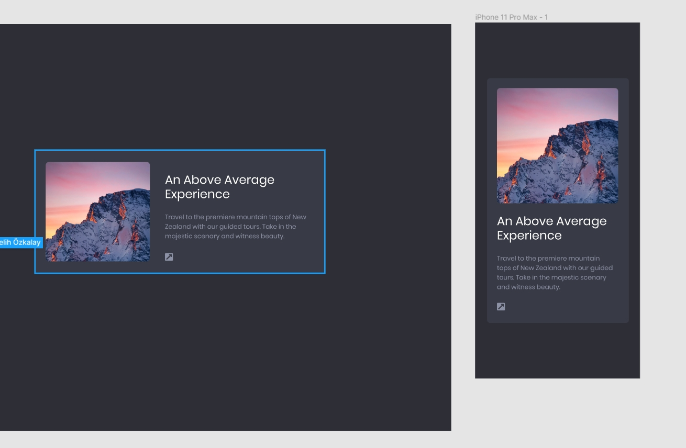
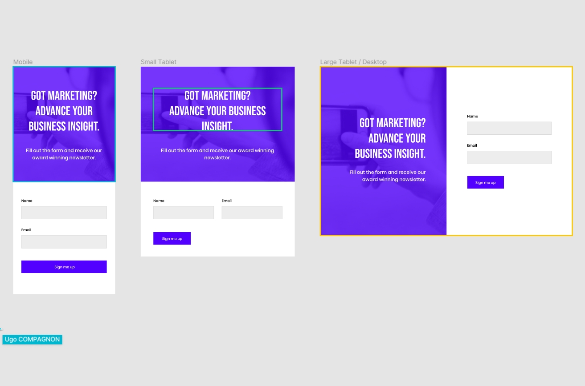
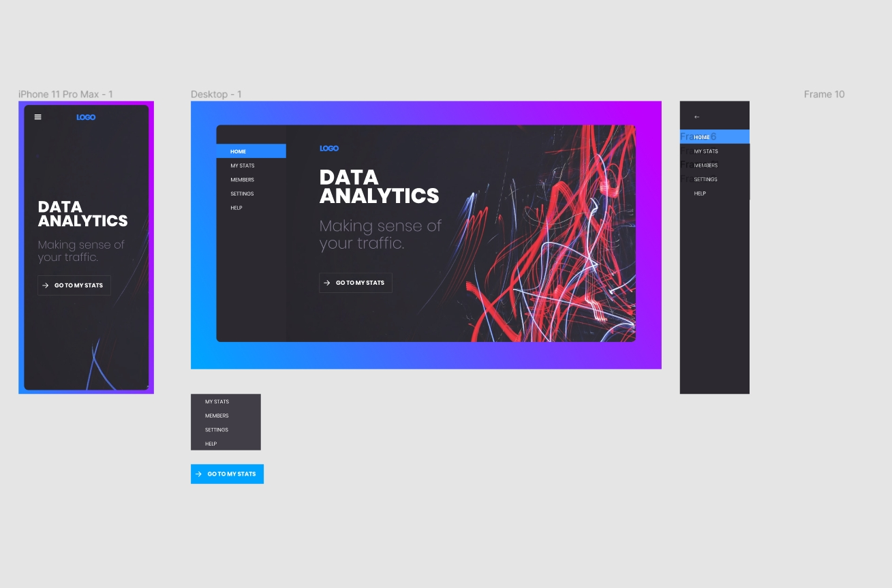
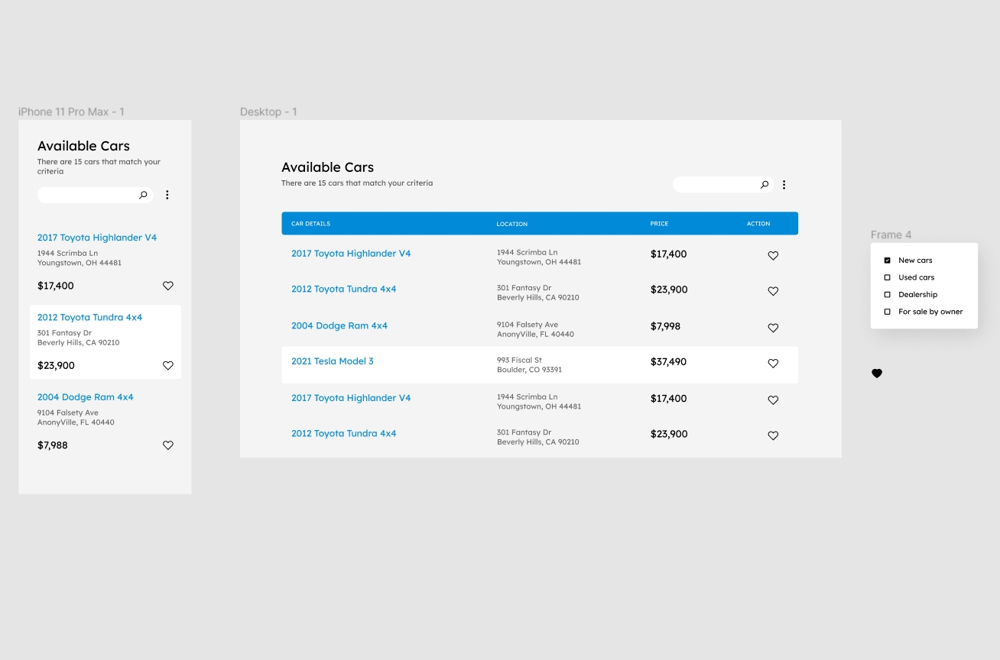
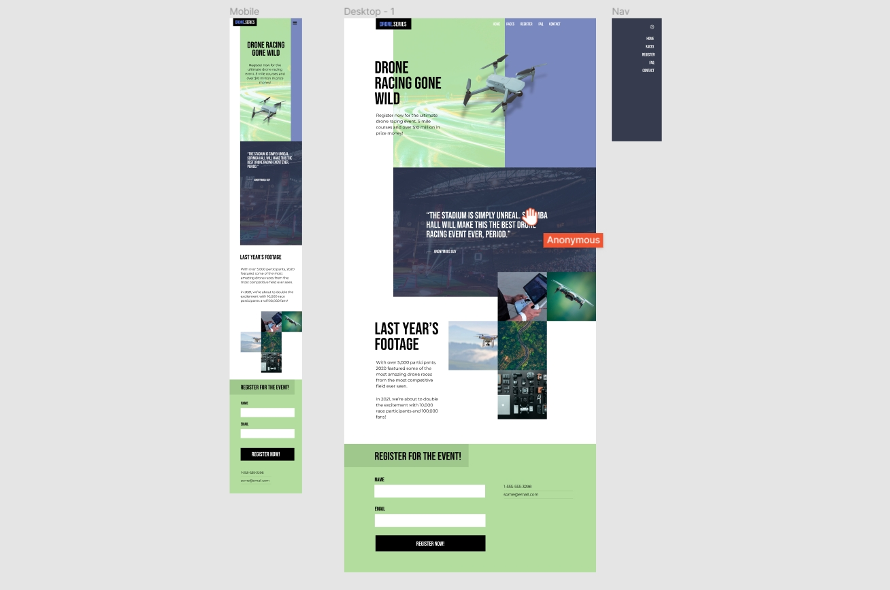

# Building a five frontend projects 

This is my code/solutions for 5 projects following the great, short and direct "Figma to code" course!
Source:  https://scrimba.com/learn/figmatocode/

## Benefit:
Practice making high-quality mockups a reality in the browser with five stunning projects created by a UI expert and coded by myself.

## What I learned experimented with?

* Viewing Figma designs
* Using ems and rems
* Structuring HTML
* Flexbox
* CSS Grid
* Responsive development
* Animated navigations
* Mobile-first development
* Using SVGs
* Media queries
* Forms
* Advanced backgrounds
* Burger menus
* Logos
* Icons
* Dropdowns
* Like functionality
* Complex grid layouts

## List of projects:

### 1. Simple card project

### 2. Landing page project

### 3. Dashboard project

### 4. Car listing project

### 5. Dron racing project

